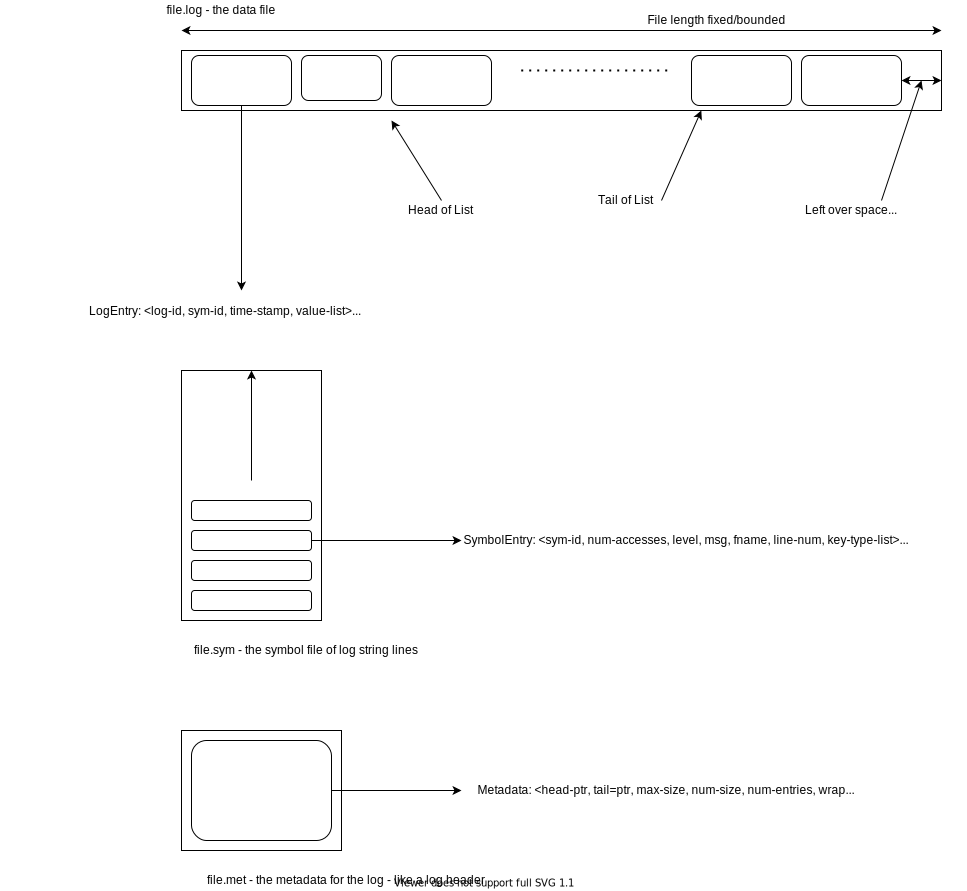

# logsym
## Motivation
Program logging can take up a lot of file space, particularly on a server which is 
servicing a lot of requests. In such conditions, one may not reserve enough space
for the log files and it may not cover the time span of the issue that the investigator
is trying to diagnose. Also, when using logging one can then become cautious about logging
too much in fear that the message may appear too frequently - we ideally want to support the
cases of a particular log message appearing frequently so that we can have a better
mindset of logging support.

## Making Log Files Smaller
### Symbol file
A program debug log is essentially passing through the same points in the code and therefore
the same lines of code. This means that the message is essentially the same except for the time stamp,
the values of variables used in the message and process/thread id. In order to save memory,
it makes sense to use a structured form of logging which abstracts out the variables into key/value pairs
and the key message which is a constant contextual sentence, is kept separate.

To this end, the proposal is to keep a hash table of contextual messages in a separate file so that
these messages are just stored once. Also, we can store the frequency of these messages so that we get
a profile of these code lines i.e. how many times is a particular code line visited during a program run.

### Internally rotating in 1 binary file
A log file is often split into multiple files of the same size and when a limit is reached the log files
are rotated. For say 5 files of 10Mb each, it means that when the logs are full it is storing records
in the files between 4 X 10Mb and 5 x 10Mb in size. This means although we have reserved the space for 5 x 10Mb,
we may actually be only using, in the worse case, of 4 x 10Mb (we have just rotated and just about to write
to the new file).
An alternative to this is to actually store the variable data in 1 main file and rotate internally to
this file. This will importantly maximise the use of the space and also simplify the set up of the log.
To do the internal rotation, it makes more sense to use a binary file instead of textual file.
Also, to improve file system allocation the main data file can be pre-allocated to the maximum size. 

### File Structure

The log consists of 3 files:
* file.log - this contains the variable data records
* file.sym - this contains the strings that are constant lines of code
* file.met - this contains metadata about the file.log file

Although, there is no upper limit theoretically in the file.sym file, it is bounded by the number
of log lines in the version of the code base being logged.
